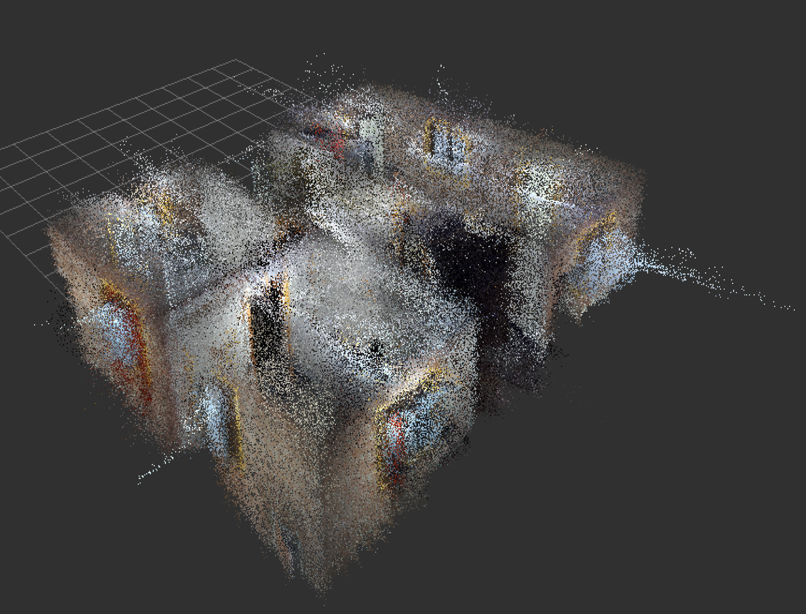
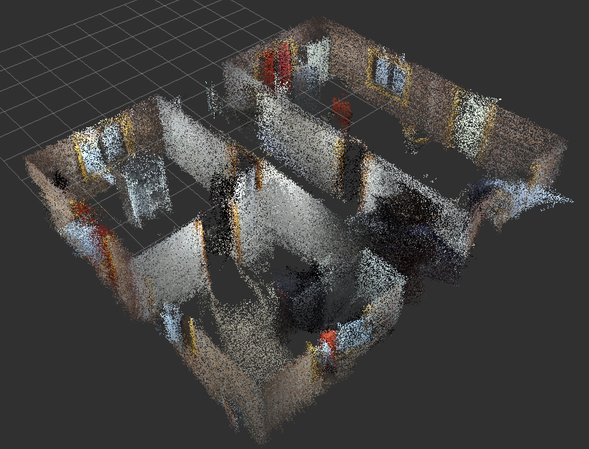

# 3D Point Cloud Filtering
In this project, a ROS node is designed to filter a noisy cumulative point cloud main structures of the reconstructed building.

## Quick Start
```bash
# Clone the repository
git clone https://github.com/shaohsuanhung/3D-point-cloud-filtering.git  

# Play the rosbag file
rosrun pcl_ros pcd_to_pointcloud ./code/test_ws/pcd_data/rawdata.pcd 5  _frame_id:=/map
```

## Results
The following images show the results of the filtering process. The first image shows the original point cloud, and the second image shows the filtered point cloud. The details of the filtering process are described in the [report](./3DCV_final_project_3.pdf).
### Before Filtering

### After Filtering
The filtered point cloud is shown in the following image. The main structures of the building are preserved, and the noise is removed.


